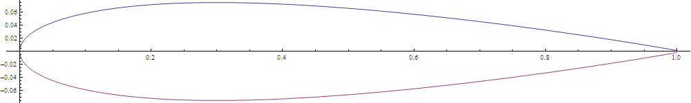

# Airfoil Data for Interpolation

Just a file for understanding the airfoil data.

## Table of Contents

1. [Introduction](#introduction)
2. [Data format](#data-format)
3. [References](#references)

## Introduction

The airfoil boundary is defined by the following formula:
$$y = 5t[0.2969\sqrt{x}-0.1260x-0.3516x^2+0.2843x^3-0.1015x^4]$$
where, $t\in[0,1]$ controls the thickness and $x\in[0,1]$ is the parameter indicating the span (horizontal length) of the wing.

The formula gives only the top half of the boundary. For symmetric wings, we just invert the top half for the bottom half.

## Data format

The data consists of coordinates for interior, exterior and the boundary region with the following details:

- Domain in x,y: $[-2,3]\times[-1,1]$
- Airfoil location: $[0,1]\times[-y_max,y_max]$
- Boundary region: $t_b = 0.1$

Files are csv formatted with the following structure (includes headers):

| x_coordinate | y_coordinate |
|--------------|--------------|
| 0.0          | 0.0          |
| 0.01         | 0.003        |
| ...          | ...          |

## References

- [NACA Airfoil Wiki page](https://en.wikipedia.org/wiki/NACA_airfoil)
